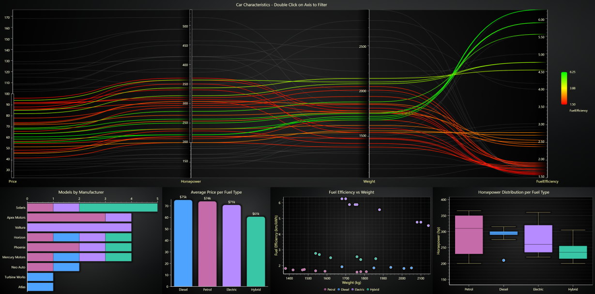

# Parallel Coordinate Chart Dashboard

This demo application belongs to the set of examples for LightningChart JS, data visualization library for JavaScript.

LightningChart JS is entirely GPU accelerated and performance optimized charting library for presenting massive amounts of data. It offers an easy way of creating sophisticated and interactive charts and adding them to your website or web application.

The demo can be used as an example or a seed project. Local execution requires the following steps:

-   Make sure that relevant version of [Node.js](https://nodejs.org/en/download/) is installed
-   Open the project folder in a terminal:

          npm install              # fetches dependencies
          npm start                # builds an application and starts the development server

-   The application is available at _http://localhost:8080_ in your browser, webpack-dev-server provides hot reload functionality.

## Description

A Parallel Coordinate Chart dashboard displaying simulated car charasteristics data.

The _Parallel Coordinate Chart_ has a built-in _Range Selector_ tool that allows users to define a value range `[start, end]` along 1 specific Axis, and highlights the series whose value is within that range.
This example uses multiple Range selectors, created using `Axis.addRangeSelector` method. Only series that pass all the conditions are highlighted.

Range selectors can be freely moved/resized by dragging on them, or deleted by double clicking on one.

Below the parallel chart, several additional chart types visualize the highlighted data:
-   _Horizontal Stacked Bar Chart_  
-   _Vertical Bar Chart_ 
-   _Scatter Chart_ using _ChartXY_ and _PointSeries_
-   _Box and Whiskers Chart_ using _ChartXY_, _BoxSeries_ and _PointSeries_ for outliers

The charts below dynamically update to reflect the currently highlighted series in the parallel chart, providing an interactive and coordinated data exploration experience.

## API Links

* [Parallel Coordinate Chart]
* [XY Chart]
* [LUT]
* [Bar Chart Types]
* [Point Series]
* [Box and Whiskers]

## Support

If you notice an error in the example code, please open an issue on [GitHub][0] repository of the entire example.

Official [API documentation][1] can be found on [LightningChart][2] website.

If the docs and other materials do not solve your problem as well as implementation help is needed, ask on [StackOverflow][3] (tagged lightningchart).

If you think you found a bug in the LightningChart JavaScript library, please contact sales@lightningchart.com.

Direct developer email support can be purchased through a [Support Plan][4] or by contacting sales@lightningchart.com.

[0]: https://github.com/Arction/
[1]: https://lightningchart.com/lightningchart-js-api-documentation/
[2]: https://lightningchart.com
[3]: https://stackoverflow.com/questions/tagged/lightningchart
[4]: https://lightningchart.com/support-services/

© LightningChart Ltd 2009-2025. All rights reserved.

[Parallel Coordinate Chart]: https://lightningchart.com/js-charts/api-documentation/v8.1.0/classes/ParallelCoordinateChart.html
[XY Chart]: https://lightningchart.com/js-charts/api-documentation/v8.1.0/classes/ChartXY.html
[LUT]: https://lightningchart.com/js-charts/api-documentation/v8.1.0/classes/LUT.html
[Bar Chart Types]: https://lightningchart.com/js-charts/api-documentation/v8.1.0/variables/BarChartTypes.html
[Point Series]: https://lightningchart.com/js-charts/api-documentation/v8.1.0/classes/PointLineAreaSeries.html
[Box and Whiskers]: https://lightningchart.com/js-charts/api-documentation/v8.1.0/classes/BoxSeries.html

